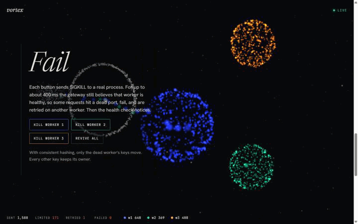

# Vortex

A scroll-driven 3D tour of a real gateway and three worker processes. Every particle is an actual HTTP request, so when you kill a worker, the process really dies and the retries you see really happened.



Most load-balancer and rate-limiter visualisers animate a scripted simulation. Vortex draws events from a running backend instead: round-robin and consistent-hash routing, a token-bucket limiter, health checks and retries, with workers as separate OS processes that you can `SIGKILL` from the page.

## Tech stack

- **Backend:** Node.js 20+, TypeScript, `node:http` and `fetch`, [`ws`](https://github.com/websockets/ws) for the event stream
- **Frontend:** Vite, Three.js (custom point-sprite shaders), [Lenis](https://github.com/darkroomengineering/lenis) for smooth scroll, no UI framework
- **Tests:** `node:test` run through `tsx`, including integration tests that spawn real worker processes
- **CI:** GitHub Actions: typecheck, tests, production build

## Architecture

```
 browser (Three.js scene + controls)
    │  WebSocket /events  ◄── routed · done · retry · limited · failed · worker up/down
    │  POST /api/*        ──► config, burst, kill/revive worker
    ▼
 gateway (one process)
    ├─ token bucket        reject over-limit requests before any worker is touched
    ├─ router              round-robin  |  consistent-hash ring (64 vnodes per worker)
    ├─ retry               on a failed call, mark the worker down and try the next candidate
    └─ health probe        GET /health every 400 ms; flips workers up/down
    │  HTTP
    ▼
 worker 1   worker 2   worker 3        three separate OS processes (child_process.fork)
```

- **Real events, real failure.** Killing a worker sends `SIGKILL` to its process. The gateway doesn't know until a request fails or the next health probe runs, so for up to ~400 ms it keeps routing to the dead port. Those failures trigger real retries on other workers.
- **One scene, five camera stops.** A single Three.js scene stays pinned behind the page. Scroll position blends between camera stops (hero, balance, shard, fail, limit), and entering a chapter switches the gateway's strategy or rate limit to match.
- **Why Node end to end.** The event stream has to reach a browser, so the gateway speaks WebSocket natively, the shared event types are plain TypeScript used by both sides, and there is nothing to install beyond Node. Workers are plain HTTP servers rather than containers so that "kill a node" is a single signal and the repo runs with `npm start`.
- **Simulated fallback.** If the page can't reach a gateway (for example on a static host), it runs a small in-browser simulator that reuses the same `HashRing` and `TokenBucket` code. The header then reads **SIMULATED · NO BACKEND** instead of **LIVE**.

## Key features

- Round-robin vs consistent-hash routing, switched live. The hash ring is covered by tests: when a node dies, only that node's keys move.
- Token-bucket rate limiting with a configurable rate. Rejected requests shatter at the gateway ring and never reach a worker.
- Worker failure from the UI with real process kills, health-check detection, and retry on a different worker.
- A live ledger (sent, limited, retried, failed, per-worker served) computed from the same event stream that drives the particles.
- Works without WebGL (the page and controls still work) and respects `prefers-reduced-motion`.

## Setup

Requires Node 20 or newer.

```bash
npm install
npm start          # builds the frontend, starts the gateway and 3 workers on http://localhost:8080
```

For development with hot reload (gateway on :8080, Vite on :5173):

```bash
npm run dev
```

Other scripts:

```bash
npm test           # unit tests + integration tests that spawn real worker processes
npm run lint       # tsc --noEmit
npm run build      # production frontend into web/dist
```

### HTTP API

| Method | Path | Body | Purpose |
| --- | --- | --- | --- |
| GET | `/api/state` | | Workers, config and counters |
| POST | `/api/config` | `{ strategy?, rps?, rateLimit?: { rate, burst } }` | Change routing strategy, synthetic traffic or limiter |
| POST | `/api/burst` | `{ n }` | Send `n` requests at once |
| POST | `/api/request` | `{ key }` | Send one request with a specific key |
| POST | `/api/workers/:id/kill` | | `SIGKILL` a worker process |
| POST | `/api/workers/:id/revive` | | Start it again |
| WS | `/events` | | Stream of `VortexEvent` (see [`shared/types.ts`](shared/types.ts)) |

## Limitations

- The gateway is a single process; it demonstrates routing behaviour, not gateway high availability.
- Workers simulate work with a short randomised delay (about 40 ms) rather than doing real computation.
- Rate limiting is one global bucket, not per client.
- Not load-tested. Synthetic traffic is capped at 80 requests per second to keep the particle scene readable.

## Why I built this

I wanted a way to see distributed-systems behaviour (retries after a node dies, which keys move under consistent hashing) driven by a system that actually runs, instead of a scripted animation. It is also a study of the scroll-and-particle style used on product launch pages.
